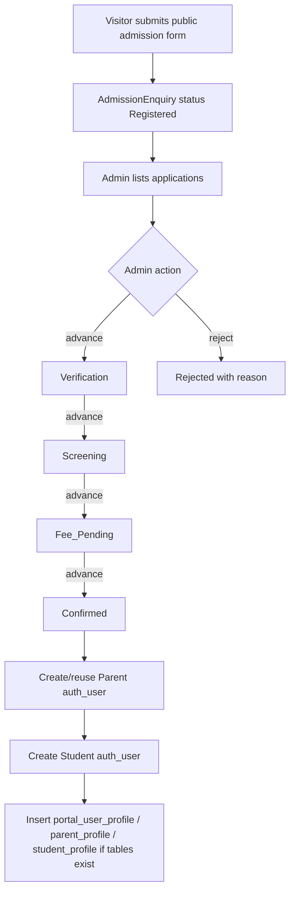
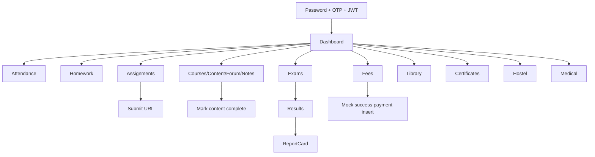
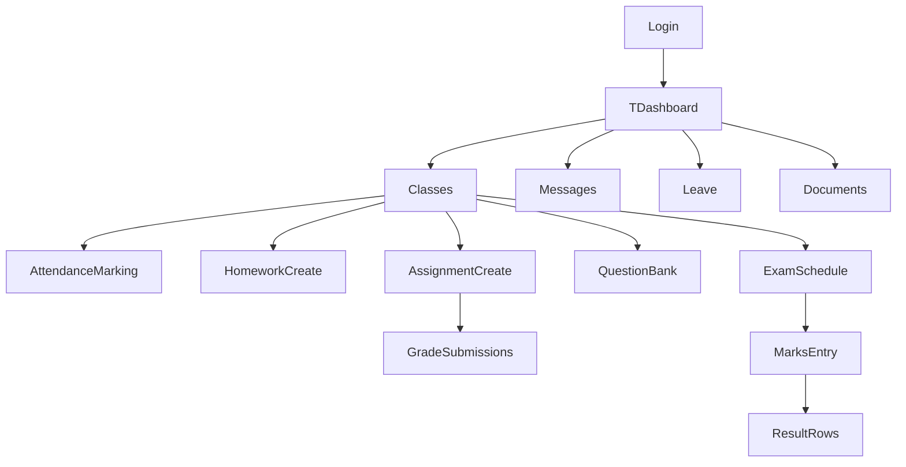
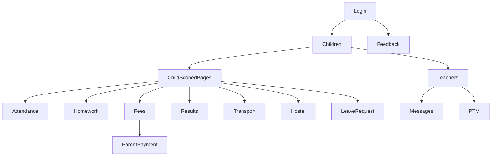
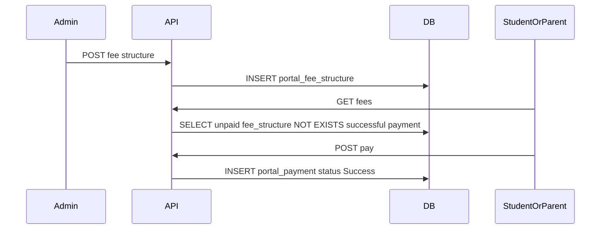
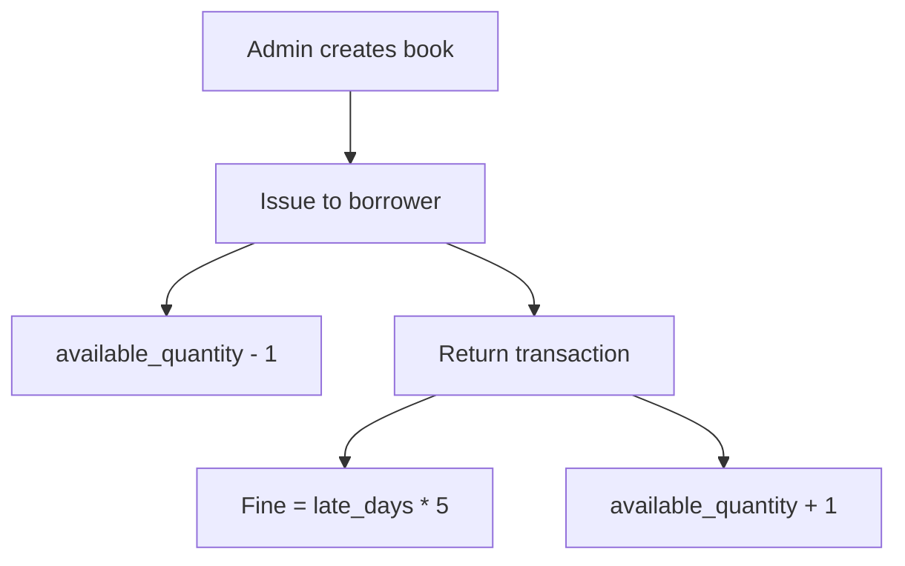

# EduNova ERP Repository Ownership Audit

Date: 2026-07-06  
Scope read: first-party source/config/SQL/docs/assets inventory, excluding vendored/generated runtime internals (`backend/venv`, `frontend/node_modules`, `__pycache__`, `*.pyc`). Those directories are present in the repository and are a hygiene issue, but they are not product source. Secret values in `.env` were not reproduced.

## 1. Executive Summary

EduNova is a Django 5 + DRF + React/Vite Education ERP with public CMS/admissions pages and role portals for Student, Parent, Teacher, and Admin. The codebase is functional for demos and many workflows are implemented, but the architecture is not yet production-grade: most ERP domain tables are unmanaged `portal_*` SQL tables accessed through raw SQL in views; there is no test suite; API validation is thin; payment, OTP delivery, file upload, backup, and deployment hardening are incomplete.

The strongest area is breadth: admissions, attendance, homework, assignments, LMS, exams, fees, library, hostel, transport, visitors, alumni, medical records, CMS, notices, messaging, PTM, and audit log all have code paths. The weakest areas are ownership boundaries, transaction correctness, authorization depth, validation, observability, and production operations.

Critical finding: global DRF default permission is `AllowAny`; portal views compensate with view-level mixins, but any future endpoint without explicit permission becomes public. Several CMS/admissions endpoints are intentionally public, but the default is dangerous for a product with student, fee, medical, and parent PII.

## 2. Repository Map

Backend:
- `backend/config`: Django settings, URL root, WSGI, status dashboard.
- `backend/apps/cms`: Django-managed public CMS models, serializers, read-only viewsets, seed command.
- `backend/apps/admissions`: Django-managed public admission enquiry model/API/admin/migrations.
- `backend/portal`: raw-SQL ERP APIs for auth, student, teacher, parent, admin, LMS extras, exams, facilities, RBAC, management commands, SQL extensions.
- `backend/portal/sql`: canonical `portal_*` schema extensions.
- `backend/manage.py`, `requirements.txt`, `Dockerfile`, `docker-compose.yml`.

Frontend:
- `frontend/src/routes/AppRoutes.jsx`: public routes and portal route mounts.
- `frontend/src/api`: public CMS/admissions axios client.
- `frontend/src/portals/public`: public website pages/home sections.
- `frontend/src/portals/student`: student auth context, protected routes, pages/components.
- `frontend/src/portals/teacher`: teacher auth context, protected routes, pages/components.
- `frontend/src/portals/parent`: parent auth context, protected routes, pages/components.
- `frontend/src/portals/admin`: admin auth context, protected routes, pages/components.
- `frontend/public/images`, `frontend/public/videos`, `frontend/src/components/*.jpeg`: static assets.

SQL/schema:
- `backend/portal/sql/portal_extension_auth_user.sql`: core ERP portal schema.
- `backend/portal/sql/portal_extension_parent_admin.sql`: parent/admin/transport/audit extensions.
- `backend/portal/sql/portal_extension_facilities.sql`: hostel/inventory/visitor/alumni/medical/LMS extras.
- `supabase/*.sql` and `supabase/*.txt`: older/shared Supabase schemas. Important mismatch: these include non-prefixed tables like `students`, `classes`, `users`, while current code uses Django `auth_user`, Django CMS/admissions tables, and prefixed `portal_*` tables.

Environment variables:
- Backend: `DJANGO_SECRET_KEY`, `DEBUG`, `DEV_STATIC_OTP`, `ALLOWED_HOSTS`, `DATABASE_URL`, `DB_SSL_REQUIRE`, `CORS_ALLOWED_ORIGINS`, `SUPABASE_URL`, `SUPABASE_SERVICE_ROLE_KEY`, `BACKUP_ENCRYPTION_KEY`, email settings.
- Frontend: `VITE_API_BASE_URL`.

Dependencies:
- Backend: Django, DRF, SimpleJWT, CORS headers, django-filter, dj-database-url, psycopg2, python-decouple/dotenv, supabase client, Pillow, gunicorn, cryptography.
- Frontend: React 18, React Router 6, Axios, Lucide, Recharts, Vite, Tailwind.

## 3. Database Reverse Engineering

Django-managed tables:
- CMS: `cms_schoolsettings`, `cms_campus`, `cms_academicprogram`, `cms_department`, `cms_leadershipmember`, `cms_schoolstat`, `cms_whychooseitem`, `cms_technologypartner`, `cms_cmspage`, `cms_newspost`, `cms_event`, `cms_galleryalbum`, `cms_galleryimage`, `cms_achievement`, `cms_testimonial`, `cms_faq`, `cms_document`, `cms_jobposting`, `cms_contactsubmission`, `cms_scholarshipinfo`.
- Admissions: `admissions_admissionenquiry`.
- Django auth/session/admin tables.

Portal SQL tables:
- Identity/profile: `portal_user_profile`, `portal_parent_profile`, `portal_teacher_profile`, `portal_student_profile`, `portal_employee`.
- Academics: `portal_class`, `portal_subject`, `portal_student_enrollment`, `portal_academic_allocation`, `portal_timetable`.
- Attendance/homework/LMS: `portal_attendance`, `portal_homework`, `portal_course`, `portal_course_content`, `portal_assignment`, `portal_assignment_submission`, `portal_quiz`, `portal_quiz_question`, `portal_question_bank`, `portal_forum_topic`, `portal_forum_post`, `portal_digital_note`, `portal_course_progress`, `portal_teacher_document`.
- Exams: `portal_exam_schedule`, `portal_hall_ticket`, `portal_result`.
- Finance/library: `portal_fee_structure`, `portal_payment`, `portal_book`, `portal_library_transaction`.
- Communications/admin: `portal_notification`, `portal_leave`, `portal_message`, `portal_audit_log`, `portal_ptm_booking`, `portal_parent_feedback`.
- Facilities: `portal_vehicle`, `portal_route`, `portal_transport_allocation`, `portal_live_bus_log`, `portal_hostel`, `portal_room`, `portal_hostel_allocation`, `portal_inventory`, `portal_visitor_log`, `portal_alumni`, `portal_medical_log`, `portal_certificate`.

Key constraints/indexes:
- Primary owner FK: most `portal_*` user references target `auth_user(id)`.
- Important unique constraints: `portal_user_profile.user_id`, `portal_student_profile.admission_number`, `portal_student_profile.qr_id_code`, `portal_class(name, section)`, `portal_subject.subject_code`, `portal_student_enrollment(student_id, class_id, academic_year)`, `portal_academic_allocation(class_id, subject_id, teacher_id)`, `portal_attendance(student_id, class_id, date)`, `portal_assignment_submission(assignment_id, student_id)`, `portal_result(student_id, exam_schedule_id)`, `portal_payment.transaction_id`, `portal_book.isbn`, `portal_book.barcode_id`, `portal_transport_allocation.student_id`, `portal_alumni.student_id`, `portal_course_progress(student_id, content_id)`.
- Helpful indexes exist for user type, enrollment student, allocation teacher, attendance student/date, message sender/receiver, bus log vehicle/date, transport student, PTM parent, employee department, hostel allocation student, inventory department, visitor check-in, alumni year, medical student, forum topic/course, post/topic, digital note/course, course progress/student.

Dependency graph:

```mermaid
erDiagram
  auth_user ||--o| portal_user_profile : owns
  auth_user ||--o| portal_student_profile : student
  auth_user ||--o| portal_parent_profile : parent
  auth_user ||--o| portal_teacher_profile : teacher
  auth_user ||--o{ portal_student_enrollment : enrolls
  portal_class ||--o{ portal_student_enrollment : contains
  portal_class ||--o{ portal_academic_allocation : allocated
  portal_subject ||--o{ portal_academic_allocation : allocated
  auth_user ||--o{ portal_academic_allocation : teaches
  portal_class ||--o{ portal_attendance : class
  auth_user ||--o{ portal_attendance : student
  portal_assignment ||--o{ portal_assignment_submission : submissions
  portal_exam_schedule ||--o{ portal_result : results
  portal_fee_structure ||--o{ portal_payment : paid
  portal_book ||--o{ portal_library_transaction : loaned
  portal_course ||--o{ portal_course_content : content
  portal_course ||--o{ portal_forum_topic : topics
  portal_forum_topic ||--o{ portal_forum_post : replies
  portal_room ||--o{ portal_hostel_allocation : allocations
```

Database risks:
- Many raw SQL reads filter by `student_id`, `class_id`, `teacher_id`, dates, and status without matching composite indexes.
- `portal_payment.id` is UUID, but some API responses and UI code may treat IDs as opaque strings; OK if preserved, risky if numeric assumptions appear later.
- `portal_room.occupied_beds` is denormalized and updated manually; allocation/vacate operations are not locked with `SELECT FOR UPDATE`, so concurrent allocations can overbook.
- No `CHECK` constraints for non-negative fees, book quantities, room capacity, marks bounds, date ranges, or payment status values.
- Admin simple table APIs insert FK IDs directly without object existence validation.
- Older Supabase schema files are not aligned with current code, creating onboarding/deployment confusion.

## 4. Complete API Catalogue

Authentication:
| Method | URL | Auth | View | Tables | Frontend |
|---|---|---|---|---|---|
| POST | `/api/auth/login/` | Public throttled | `login_step1` | `auth_user`, `portal_user_profile`, cache | all portal login contexts |
| POST | `/api/auth/verify-otp/` | Public throttled | `login_step2_verify_otp` | `auth_user`, cache | all portal login contexts |
| POST | `/api/auth/resend-otp/` | Public throttled | `resend_otp` | `auth_user`, cache | all portal login contexts |
| POST | `/api/auth/refresh/` | refresh token | SimpleJWT | token only | portal axios interceptors |

Public CMS/admissions:
| Method | URL | Auth | View/serializer | Tables | Frontend |
|---|---|---|---|---|---|
| GET | `/api/cms/settings/` | Public | `SchoolSettingsViewSet` | `cms_schoolsettings` | hero/settings |
| GET | `/api/cms/campuses/` | Public | `CampusViewSet` | `cms_campus` | no direct call found |
| GET | `/api/cms/academic-programs/` | Public | `AcademicProgramViewSet` | `cms_academicprogram` | home/academics |
| GET | `/api/cms/departments/` | Public | `DepartmentViewSet` | `cms_department` | departments |
| GET | `/api/cms/leadership/` | Public | `LeadershipMemberViewSet` | `cms_leadershipmember` | faculty |
| GET | `/api/cms/stats/` | Public | `SchoolStatViewSet` | `cms_schoolstat` | hero/achievements |
| GET | `/api/cms/why-choose/` | Public | `WhyChooseItemViewSet` | `cms_whychooseitem` | home |
| GET | `/api/cms/tech-partners/` | Public | `TechnologyPartnerViewSet` | `cms_technologypartner` | API helper only |
| GET | `/api/cms/pages/`, `/api/cms/pages/{slug}/` | Public | `CMSPageViewSet` | `cms_cmspage` | CMSPageView |
| GET | `/api/cms/news/` | Public | `NewsPostViewSet` | `cms_newspost` | news/home |
| GET | `/api/cms/events/` | Public | `EventViewSet` | `cms_event` | events/home |
| GET | `/api/cms/gallery-albums/` | Public | `GalleryAlbumViewSet` | `cms_galleryalbum`, `cms_galleryimage` | gallery/home |
| GET | `/api/cms/gallery-images/` | Public | `GalleryImageViewSet` | `cms_galleryimage` | API helper only |
| GET | `/api/cms/achievements/` | Public | `AchievementViewSet` | `cms_achievement` | achievements |
| GET | `/api/cms/testimonials/` | Public | `TestimonialViewSet` | `cms_testimonial` | home |
| GET | `/api/cms/faqs/` | Public | `FAQViewSet` | `cms_faq` | FAQ/home |
| GET | `/api/cms/documents/?audience=` | Public | `DocumentViewSet` | `cms_document` | downloads/API helper |
| GET | `/api/cms/jobs/` | Public | `JobPostingViewSet` | `cms_jobposting` | careers |
| GET | `/api/cms/scholarships/` | Public | `ScholarshipInfoViewSet` | `cms_scholarshipinfo` | scholarships banner |
| POST | `/api/cms/contact/` | Public | `ContactSubmissionViewSet` | `cms_contactsubmission` | contact section |
| POST | `/api/admissions/enquiries/` | Public | `AdmissionEnquiryViewSet` | `admissions_admissionenquiry` | public admissions form |

Student APIs:
| Method | URL | Auth | View | Tables | Frontend |
|---|---|---|---|---|---|
| GET | `/api/student/profile/` | Student | `ProfileView` | `auth_user`, profile/enrollment/class | Profile/Dashboard |
| GET | `/api/student/dashboard/` | Student | `DashboardView` | attendance, assignment, exam, result, homework, notification, fees | Dashboard |
| GET | `/api/student/attendance/` | Student | `AttendanceListView` | `portal_attendance` | Attendance |
| GET | `/api/student/timetable/` | Student | `TimetableView` | timetable/class/subject/auth_user | Timetable |
| GET | `/api/student/homework/` | Student | `HomeworkListView` | homework/subject/auth_user | Homework |
| GET | `/api/student/assignments/` | Student | `AssignmentListView` | assignment/submission/subject | Assignments |
| POST | `/api/student/assignments/{id}/submit/` | Student | `AssignmentSubmitView` | assignment_submission | Assignments |
| GET | `/api/student/courses/` | Student | `CourseListView` | course/content/quiz | Lms |
| GET/POST | `/api/student/quizzes/{id}/` | Student | `QuizDetailView` | quiz/question; POST stub | Quiz |
| GET | `/api/student/exams/` | Student | `ExamListView` | exam_schedule/subject | Exams |
| GET | `/api/student/hall-tickets/` | Student | `HallTicketListView` | hall_ticket/exam/subject | Exams |
| GET | `/api/student/results/` | Student | `ResultListView` | result/exam/subject | Results |
| GET | `/api/student/fees/` | Student | `FeesView` | fee_structure/payment | Fees |
| POST | `/api/student/fees/pay/` | Student | `InitiatePaymentView` | payment | Fees |
| GET | `/api/student/library/` | Student | `LibraryView` | library_transaction/book | Library |
| GET | `/api/student/library/search/` | Student | `BookSearchView` | book | Library |
| GET | `/api/student/certificates/` | Student | `CertificateListView` | certificate | Certificates |
| GET | `/api/student/announcements/` | Student | `AnnouncementListView` | notification or cms_newspost | Announcements |
| GET | `/api/student/events/` | Student | `EventListView` | cms_event | Events |
| GET | `/api/student/hostel/` | Student | `StudentHostelView` | hostel_allocation/room/hostel | Hostel |
| GET | `/api/student/medical-records/` | Student | `StudentMedicalView` | medical_log | MedicalRecords |
| GET | `/api/student/report-card/` | Student | `StudentReportCardView` | result/exam/subject/enrollment/allocation | Results |

LMS shared APIs:
| Method | URL | Auth | View | Tables | Frontend |
|---|---|---|---|---|---|
| GET/POST | `/api/lms/forum-topics/` | Authenticated + course access | `ForumTopicListView` | forum_topic/course/enrollment/allocation | CourseForum |
| GET | `/api/lms/forum-topics/{id}/` | Authenticated + course access | `ForumTopicDetailView` | forum_topic/forum_post | CourseForum |
| POST | `/api/lms/forum-topics/{id}/reply/` | Authenticated + course access | `ForumPostView` | forum_post/topic | CourseForum |
| GET/POST | `/api/lms/notes/` | Authenticated + course access | `DigitalNoteView` | digital_note/course | CourseForum |
| POST | `/api/lms/mark-complete/` | Authenticated + course access | `MarkContentCompleteView` | course_progress/content | Lms |
| GET | `/api/lms/analytics/` | Admin/Teacher | `CourseAnalyticsView` | course_content/progress/auth_user | no direct frontend call found |

Teacher APIs:
| Method | URL | Auth | View | Tables | Frontend |
|---|---|---|---|---|---|
| GET | `/api/teacher/profile/` | Teacher | `TeacherProfileView` | profile/teacher_profile | Topbar/API gap: limited use |
| GET | `/api/teacher/dashboard/` | Teacher | `TeacherDashboardView` | allocation/timetable/exam/submission/message/attendance | Dashboard/Topbar |
| GET | `/api/teacher/classes/` | Teacher | `MyClassesView` | allocation/class/subject/enrollment | Classes and forms |
| GET | `/api/teacher/classes/{id}/roster/` | Teacher | `ClassRosterView` | enrollment/student_profile | API not directly called |
| GET/POST | `/api/teacher/attendance/` | Teacher | `AttendanceView` | attendance/enrollment/student_profile | Attendance |
| GET/POST | `/api/teacher/homework/` | Teacher | `HomeworkView` | homework/allocation | Homework |
| GET/POST | `/api/teacher/assignments/` | Teacher | `AssignmentView` | assignment/submission | Assignments |
| GET | `/api/teacher/assignments/{id}/submissions/` | Teacher | `AssignmentSubmissionsView` | assignment_submission/auth_user | Assignments |
| PATCH | `/api/teacher/assignments/{id}/submissions/{sid}/` | Teacher | `AssignmentSubmissionsView` | assignment_submission | Assignments |
| GET/POST/DELETE | `/api/teacher/question-bank/`, `/api/teacher/question-bank/{id}/` | Teacher | `QuestionBankView` | question_bank/subject | QuestionBank |
| GET/POST | `/api/teacher/exams/` | Teacher | `TeacherExamView` | exam_schedule/allocation | Exams/MarksEntry |
| GET/POST | `/api/teacher/marks-entry/` | Teacher | `MarksEntryView` | exam_schedule/enrollment/result | MarksEntry |
| GET | `/api/teacher/performance/` | Teacher | `PerformanceAnalyticsView` | enrollment/result/attendance | Performance page loads classes only; analytics call not found |
| GET/POST | `/api/teacher/messages/` | Teacher | `MessageThreadView` | message/auth_user | Messages |
| GET | `/api/teacher/contacts/` | Teacher | `MyContactsView` | user_profile/auth_user | Messages |
| GET | `/api/teacher/notices/` | Teacher | `NoticeListView` | cms_newspost | Notices |
| GET/POST | `/api/teacher/leaves/` | Teacher | `LeaveView` | leave | Leave |
| GET | `/api/teacher/timetable/` | Teacher | `TeacherTimetableView` | timetable/class/subject | Timetable |
| GET/POST | `/api/teacher/documents/` | Teacher | `TeacherDocumentsView` | teacher_document/allocation | Documents |

Parent APIs:
| Method | URL | Auth | View | Tables | Frontend |
|---|---|---|---|---|---|
| GET | `/api/parent/profile/` | Parent | `ParentProfileView` | profile/parent_profile/student_profile | Profile |
| GET | `/api/parent/dashboard/` | Parent | `ParentDashboardView` | children/enrollment/attendance/fees/message | Dashboard |
| GET | `/api/parent/children/` | Parent | `ChildrenListView` | student_profile/auth_user | AuthContext |
| GET | `/api/parent/attendance/` | Parent + owns child | `ChildAttendanceView` | attendance | Attendance |
| GET | `/api/parent/homework/` | Parent + owns child | `ChildHomeworkView` | homework/subject | Homework |
| GET | `/api/parent/results/` | Parent + owns child | `ChildResultsView` | result/exam/subject | Results |
| GET | `/api/parent/fees/` | Parent + owns child | `ChildFeesView` | fee_structure/payment | Fees |
| POST | `/api/parent/fees/pay/` | Parent + owns child | `ChildFeesPayView` | payment/audit | Fees |
| GET | `/api/parent/documents/` | Parent + owns child | `ChildDocumentsView` | certificate | Documents |
| GET | `/api/parent/transport/` | Parent + owns child | `ChildTransportView` | transport_allocation/vehicle/route/live_bus_log | Transport |
| GET | `/api/parent/hostel/` | Parent + owns child | `ChildHostelView` | hostel_allocation/room/hostel | Hostel |
| GET | `/api/parent/teachers/` | Parent | `TeacherContactsView` | allocation/enrollment/subject/class | Messages/PTM |
| GET/POST | `/api/parent/messages/` | Parent | `MessageThreadView` | message | Messages |
| GET | `/api/parent/notifications/` | Parent | `NotificationListView` | notification | Notifications |
| GET/POST | `/api/parent/leaves/` | Parent + owns child | `LeaveRequestView` | leave | LeaveRequests |
| GET/POST | `/api/parent/ptm/` | Parent | `PtmBookingView` | ptm_booking/auth_user | PtmBooking |
| GET/POST | `/api/parent/feedback/` | Parent | `FeedbackView` | parent_feedback | Feedback |

Admin APIs:
| Method | URL | View | Tables | Frontend |
|---|---|---|---|---|
| GET | `/api/admin-portal/dashboard/` | `AdminDashboardView` | admission + portal counts/payments | Dashboard |
| GET | `/api/admin-portal/admissions/` | `AdmissionListView` | admissions | Admissions |
| POST | `/api/admin-portal/admissions/{reg}/action/` | `AdmissionActionView` | admissions/auth/profile/audit | Admissions |
| GET/POST | `/api/admin-portal/users/` | `UserListView` | auth_user/groups/user_profile | Users |
| PATCH | `/api/admin-portal/users/{id}/` | `UserDetailView` | auth_user/groups/user_profile/audit | Users |
| POST | `/api/admin-portal/users/{id}/reset-password/` | `UserDetailView` | auth_user/audit | Users |
| GET | `/api/admin-portal/roles/` | `RolesView` | groups | API not called |
| GET/POST | `/api/admin-portal/classes/` | `ClassView` | class | Classes |
| GET/POST | `/api/admin-portal/subjects/` | `SubjectView` | subject | Classes |
| GET/POST | `/api/admin-portal/vehicles/` | `VehicleView` | vehicle | Transport |
| GET/POST | `/api/admin-portal/routes/` | `RouteView` | route | Transport |
| GET/POST | `/api/admin-portal/transport-allocations/` | `TransportAllocationView` | transport_allocation | Transport |
| GET/POST | `/api/admin-portal/fee-structures/` | `FeeStructureView` | fee_structure | Fees |
| GET | `/api/admin-portal/payments/` | `PaymentListView` | payment/fee/auth_user | Fees |
| GET/POST | `/api/admin-portal/library/books/` | `LibraryBookView` | book | Library |
| POST | `/api/admin-portal/library/issue/` | `LibraryIssueView` | book/library_transaction/audit | Library |
| POST | `/api/admin-portal/library/return/{id}/` | `LibraryReturnView` | book/library_transaction/audit | Library |
| GET/POST | `/api/admin-portal/notices/` | `NoticeBroadcastView` | notification/audit | Notices |
| GET | `/api/admin-portal/leaves/` | `LeaveApprovalListView` | leave/auth_user | Leaves |
| POST | `/api/admin-portal/leaves/{id}/decide/` | `LeaveApprovalListView` | leave/audit | Leaves |
| GET | `/api/admin-portal/reports/` | `ReportsView` | attendance/payment/result | Reports |
| GET | `/api/admin-portal/audit-log/` | `AuditLogListView` | audit_log/auth_user | AuditLog |
| GET | `/api/admin-portal/backup/export/` | `BackupExportView` | many portal tables/audit | Settings |
| GET/POST | `/api/admin-portal/hostels/` | `HostelView` | hostel | Hostel |
| GET/POST | `/api/admin-portal/rooms/` | `RoomView` | room/hostel/audit | Hostel |
| GET/POST | `/api/admin-portal/hostel-allocations/` | `HostelAllocationView` | allocation/room/audit | Hostel |
| POST | `/api/admin-portal/hostel-allocations/{id}/vacate/` | `HostelVacateView` | allocation/room/audit | Hostel |
| GET/POST/PATCH | `/api/admin-portal/inventory/` | `InventoryView` | inventory/audit | Inventory |
| GET/POST | `/api/admin-portal/visitors/` | `VisitorLogView` | visitor_log/audit | Visitors |
| POST | `/api/admin-portal/visitors/{id}/checkout/` | `VisitorCheckoutView` | visitor_log/audit | Visitors |
| GET/POST | `/api/admin-portal/alumni/` | `AlumniView` | alumni/auth_user/audit | Alumni |
| GET/POST | `/api/admin-portal/medical-logs/` | `MedicalLogView` | medical_log/auth_user/audit | MedicalRecords |
| GET/POST | `/api/admin-portal/rank-list/` | `RankListView` | result/exam/audit | ExamResults |
| GET | `/api/admin-portal/rank-list/overall/` | `OverallRankListView` | result/exam/enrollment | ExamResults |
| GET | `/api/admin-portal/report-card/` | `ReportCardView` | result/exam/subject | ExamResults |

Common status codes: successful GET/POST usually `200`; validation errors use `400`; missing records use `404`; ownership/course access uses `403`; throttling uses DRF `429`; JWT failures use `401`.

## 5. Frontend to Backend Mapping

Public pages call `cmsApi` and `admissionsApi` through `frontend/src/api/client.js`. Portal pages each use a role-specific axios client with JWT access token injection and refresh handling. Tokens and user payloads are stored in `localStorage` under role-specific keys.

Important mappings:
- Public `Admissions.jsx` -> `POST /api/admissions/enquiries/` -> `AdmissionEnquiry` table.
- Public home/news/events/gallery/faculty/departments/etc. -> `/api/cms/*` -> CMS models.
- Student Dashboard -> `/student/dashboard/`, `/student/profile/` -> attendance, assignment, exam, fee, notification, profile tables.
- Student LMS -> `/student/courses/`, `/lms/mark-complete/`, CourseForum -> forum/notes APIs -> course/content/forum/progress tables.
- Teacher Attendance -> `/teacher/classes/`, `/teacher/attendance/` -> allocation, enrollment, attendance.
- Teacher Assignments -> assignment create/list/submissions/grade APIs -> assignment/submission.
- Teacher Exams/Marks -> `/teacher/exams/`, `/teacher/marks-entry/` -> exam_schedule/result.
- Parent pages -> child-scoped `/parent/*?child_id=` APIs -> server checks `portal_student_profile.parent_id`.
- Admin pages -> `/admin-portal/*` APIs -> broad CRUD/raw SQL modules.

Frontend gaps:
- `admissionsApi.status()` calls `/admissions/enquiries/{registrationNumber}/`, but `AdmissionEnquiryViewSet` does not include retrieve lookup by registration number in the inspected code. This is a likely broken helper unless DRF default detail by numeric PK happens to match.
- Teacher `Performance.jsx` loads classes but the extracted API calls do not show `/teacher/performance/` being called; the analytics API may be underused.
- `/api/lms/analytics/`, `/api/admin-portal/roles/`, `/api/teacher/classes/{id}/roster/`, `/api/cms/campuses/`, `/api/cms/tech-partners/`, `/api/cms/gallery-images/` have no direct frontend call found.
- Admin `Settings` only exports backup; no real settings update API exists.

## 6. Business Workflow Reconstruction

Admissions:



Student:



Teacher:



Parent:



Finance:



Library:



Hostel/transport/medical/CMS workflows are present as CRUD/read flows, but do not include rich approval state machines beyond allocate/vacate, assign route, add medical log, and publish CMS data.

## 7. Authentication & Security Review

Implemented:
- Step 1 validates username/email + password, generates 6-digit OTP in Django cache.
- Step 2 validates OTP and issues SimpleJWT access/refresh tokens.
- Resend regenerates OTP.
- Access tokens live 6 hours, refresh tokens 7 days.
- OTP throttles are per-account plus higher per-IP backstop.
- `DEV_STATIC_OTP` is separated from `DEBUG`.
- RBAC is server-derived from `portal_user_profile`, Django groups, or superuser fallback.

Vulnerabilities/risks:
- No real OTP delivery code; console/email backend only. In production this must integrate email/SMS with audit and delivery failure handling.
- OTP stored in default cache. If LocMemCache is used under multi-worker Gunicorn, throttle and OTP state are per process.
- No logout/token blacklist; local logout only deletes browser storage.
- JWTs in `localStorage` are vulnerable to XSS token theft.
- Global DRF default is `AllowAny`, a dangerous default.
- Password reset returns temp password in API response.
- No CSRF protection for JWT APIs is normal, but XSS hardening must be much stronger.
- No object-level authorization in some teacher/admin operations: teacher can request arbitrary class_id in some reads/writes unless allocation is validated consistently.
- Admin export returns broad PII/medical/fee data as JSON through API.
- No audit logging for every write; many admin writes are logged, but student/teacher writes are partial.

## 8. Architecture Review

Strengths:
- Clear route split by role.
- RBAC helper centralizes role resolution.
- Parent child-ownership helper is a good pattern.
- SQL extension files document intended schema.
- Public CMS/admissions are conventional Django apps.

Smells:
- ERP domain is raw SQL in views, no ORM models, no repositories/services.
- Views mix authorization, validation, queries, serialization, and business decisions.
- No OpenAPI schema or typed contracts.
- No migrations for `portal_*`; schema drift is likely.
- Many APIs return ad hoc dicts; frontend is tightly coupled to raw response shapes.
- Some comments indicate prior security fixes; good, but also evidence that security relies on discipline rather than architecture.
- `backend/venv` and `frontend/node_modules` appear inside repo tree.

## 9. Performance Review

Risks:
- N+1 patterns: student courses loop loads content/quizzes per course; parent dashboard loops children; teacher dashboard loops classes for attendance flags.
- No `select_related/prefetch_related` because raw SQL dominates.
- Minimal pagination on portal APIs; many return all rows or hardcoded `LIMIT 200/300`.
- No Redis cache configured for production despite throttling/cache needs.
- File uploads are URL/text based in several places, not streamed/storage-managed by API.
- Backup export loads all rows from many tables into memory.
- Reports aggregate on potentially large tables without enough composite indexes.

Priority indexes to add:
- `portal_attendance(class_id, date)`.
- `portal_homework(class_id, due_date)`.
- `portal_assignment(class_id, due_date)`.
- `portal_exam_schedule(class_id, exam_date)` and `(teacher_id, exam_date)`.
- `portal_result(exam_schedule_id, marks_obtained DESC)`.
- `portal_payment(student_id, status)` and `(paid_at, status)`.
- `portal_library_transaction(borrower_id, issue_date DESC)`.
- `portal_leave(status, start_date)`.
- `portal_notification(recipient_type, target_class_id, created_at DESC)`.

## 10. Production Readiness

Present:
- Dockerfile with Gunicorn command.
- Compose file for local Postgres + backend.
- Environment examples.
- Status dashboard at `/`.

Missing/incomplete:
- Compose runs Django dev server, not Gunicorn.
- No frontend container/Nginx reverse proxy config.
- No health check endpoint for DB/cache/dependencies beyond status dashboard.
- No Redis service/cache settings.
- No CI/CD or GitHub Actions found.
- No OpenAPI/Swagger.
- No structured logging/monitoring/tracing.
- No backup scheduler; backup management command exists but not wired operationally.
- No migration automation for portal SQL.
- No static/media production storage policy.
- No load balancer/session/cache strategy.

## 11. Testing Review

No unit, integration, API, permission, authentication, frontend, or performance tests were found in first-party code. This is the largest blocker to safe ownership. Minimum suite:
- Auth OTP happy/error/throttle tests.
- RBAC tests for every role prefix.
- Parent child-object access tests.
- Teacher allocation-object access tests.
- Admin critical write tests.
- Admissions credential idempotency tests.
- Fee/library/hostel transaction tests.
- Frontend route smoke tests.

## 12. Dead Code / Missing Features

Likely unused or underused APIs:
- `/api/lms/analytics/`, `/api/admin-portal/roles/`, teacher roster endpoint, some CMS helpers.

Likely missing backend APIs:
- Admission enquiry status retrieve by `registration_number`.
- Admin CMS editing APIs from custom admin portal; CMS editing is only Django admin unless DRF read-only changed.
- Real payment gateway/receipt issuance/refunds/reconciliation.
- OTP delivery via SMS/email provider with resend limits by channel.
- Logout/refresh token blacklist.
- User self-service password reset/change.
- Teacher performance frontend call wiring.
- Admin settings update.
- Live bus GPS ingestion API.
- Certificate generation/upload workflow.
- Payroll despite `portal_employee.monthly_salary` and older schema mentioning payroll.

Dead/hygiene:
- Vendored `venv` and `node_modules` in repo tree.
- Supabase non-prefixed schema docs conflict with current `portal_*` implementation.
- `portal/serializers.py` is intentionally empty for raw-SQL APIs.
- `portal/permissions.py` is a deprecated shim to `portal.roles`.
- `portal/otp.py` has an email OTP helper using `send_mail`, but the live `auth_views.py` login flow does not call it; live OTP currently only writes to cache and returns `dev_otp` when `DEV_STATIC_OTP=True`.
- `seed_portal_demo.py` inserts exam name `Unit Test 1`; `TeacherExamView` enforces names like `Unit_Test_1`. Demo data can therefore create report-card/rank-list naming inconsistency.

## 13. Recommendations & Priority Matrix

P0 Critical:
- Change DRF default permission to `IsAuthenticated` and explicitly mark public endpoints `AllowAny`. Effort 0.5 day, impact high.
- Add Redis cache and configure OTP/throttle cache for production. Effort 1 day, impact high.
- Add permission tests for all role prefixes and object ownership. Effort 3-5 days, impact high.
- Implement real OTP delivery and remove any production possibility of static OTP. Effort 2-4 days, impact high.
- Remove secrets from `.env` tracking if committed and rotate exposed credentials. Effort 0.5-1 day, impact high.

P1 High:
- Move portal SQL into Django migrations or managed/unmanaged models with migrations. Effort 1-2 weeks, impact high.
- Introduce service layer for admissions, payments, library, hostel, exams. Effort 1-2 weeks, impact high.
- Add transactional locks for hostel allocation and library issue/return. Effort 1-2 days, impact high.
- Add validation serializers for raw SQL APIs. Effort 1 week, impact high.
- Add OpenAPI documentation. Effort 2-3 days, impact medium/high.

P2 Medium:
- Add missing indexes and pagination. Effort 2-4 days, impact medium/high.
- Wire missing frontend/API gaps. Effort 2-4 days, impact medium.
- Add CI with backend tests and frontend build. Effort 1-2 days, impact high.
- Add structured logging and audit coverage. Effort 3-5 days, impact medium.

P3 Low:
- Clean old schema docs or clearly label them historical.
- Refactor repeated auth context/API client code in frontend.
- Add admin UX polish and empty-state consistency.

## 14. Four-Week Development Roadmap

Week 1:
- Lock down permissions/default auth.
- Configure Redis cache/throttling.
- Add auth/RBAC/ownership tests.
- Remove vendored dirs from repo and update `.gitignore`.
- Add CI for tests/build.

Week 2:
- Add validation serializers for high-risk APIs.
- Fix missing frontend/backend gaps.
- Add critical indexes.
- Add transactions/locking for hostel/library/payment writes.

Week 3:
- Introduce service layer for admissions, finance, library, exams.
- Add OpenAPI/Swagger.
- Add real OTP delivery and password reset flows.
- Add production Docker/Nginx/health checks.

Week 4:
- Convert portal SQL ownership to migrations/models strategy.
- Add monitoring/logging/audit completeness.
- Implement real payment provider abstraction and receipts.
- Load test dashboard/report APIs and tune.

## 15. Enterprise Architecture Proposal

Target architecture:
- Apps by bounded context: `identity`, `admissions`, `academics`, `attendance`, `lms`, `exams`, `finance`, `library`, `transport`, `hostel`, `medical`, `cms`, `communications`, `audit`.
- For each context: models, serializers, services, selectors/repositories, views/viewsets, permissions, tests.
- Use Django ORM for domain tables. Keep raw SQL only for well-measured reports.
- Add OpenAPI schemas and frontend generated/typed client.
- Use Redis for cache/throttle, Postgres for persistence, object storage for files, Celery for email/SMS/backups/reports.
- Deploy with Nginx + Gunicorn + Postgres + Redis + worker + scheduler + frontend static build.

## 16. Scores

| Category | Score | Evidence |
|---|---:|---|
| Architecture | 5/10 | Clear role modules, but raw SQL in views and unmanaged schema dominate. |
| Security | 5/10 | Good RBAC/throttle intent, but dangerous defaults, localStorage JWT, no token blacklist, no real OTP delivery. |
| Performance | 5/10 | Basic indexes exist, but N+1 loops, large unpaginated responses, no Redis/cache strategy. |
| Maintainability | 4/10 | Broad functionality, but weak layering, no tests, ad hoc response contracts. |
| Scalability | 4/10 | Single-process assumptions for cache/throttle; no worker/cache/deployment topology. |
| Code Quality | 5/10 | Readable, pragmatic code, but validation and transactions are inconsistent. |
| Enterprise Readiness | 4/10 | Audit/log/export present, but compliance, docs, CI, operations incomplete. |
| Production Readiness | 4/10 | Dockerfile exists, but compose uses dev server and lacks health/monitoring/Redis/Nginx/CI. |
